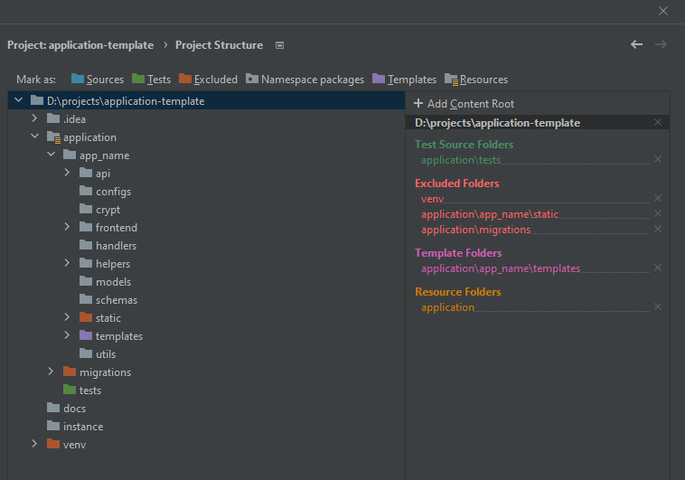
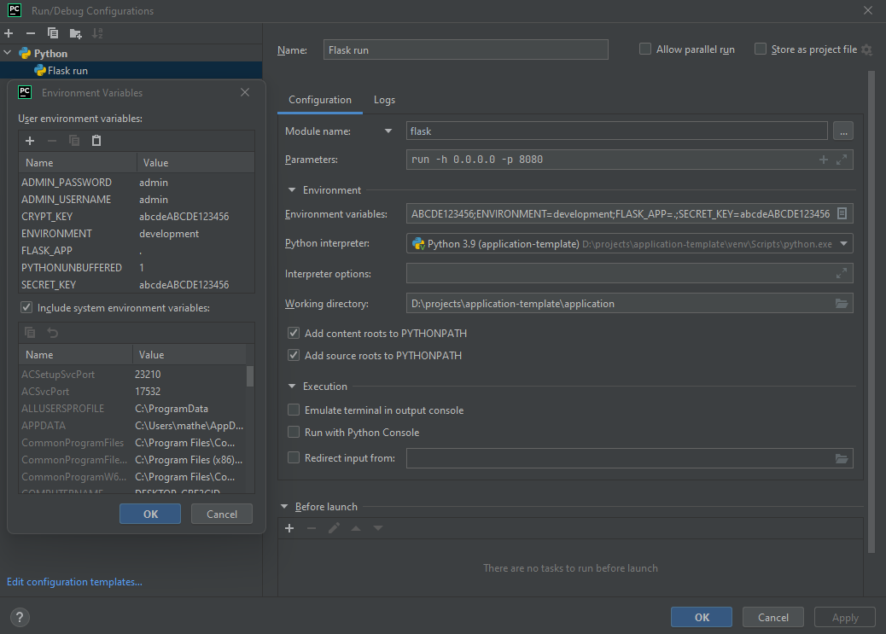
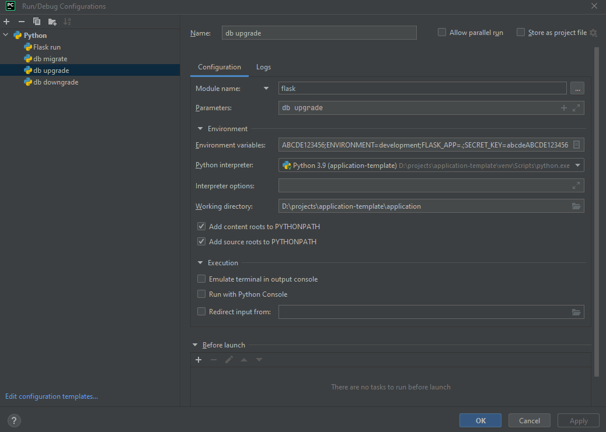

<h1 align="center">APIRestfull Application Template</h1>

<p align="center">
    
    
    

[//]: # (    )
</p>

<h3 align="center">Work in progress</h3>

Default application template for an APIRestfull software using flask and other frameworks.

This project includes all my best practices and ideas when designing a software, including tests, design patterns and logic, as well as, using a lot of different frameworks to work everything properly.

Tests are **not included yet**, im currently working in a good structure **ASAP**.


## Contributing

### Creating fork and updating with the official base version (upstream)

First of all, create a Fork based on this repository, ensure to copy not only master branch, but all other available branches and clone into your local env using `git clone https://github.com/[username]/application-template`

For this setup, you need to verify if the fork is configured with the remote upstream, to do so, execute the command: `git remote -v` inside your fork, the expected result is similar to this:

```
origin  https://github.com/[username]/application-template.git (fetch)
origin  https://github.com/[username]/application-template.git (push)
upstream  https://github.com/th3r4ven/application-template.git (fetch)
upstream  https://github.com/th3r4ven/application-template.git (push)
```

Where `origin` will be your fork and `upstream` will be the main repo.

If your fork do not have the **upstream** configured, you need to execute:
`git remote add upstream https://github.com/th3r4ven/application-template.git`

To perform the upstream synchronization:
```
git fetch upstream
git rebase upstream/[remote_branch] [local_branch]
```

e.g.:

```
git fetch upstream
git rebase upstream/v1.0.0 v1.0.0
```

### Workflow

All versions will be worked as separated branches, e.g.: 

For version 1.0.0 all its code will be available on `v1.0.0` branch, if you are working on 1.0.0 version, all your code **has** to be committed on your fork, when you are finished, open a PR to the upstream v1.0.0 version.

That way we can reduce conflicts with other developers and keep or workflow as clean as possible.


## How to work on the application

- Make sure your **python** is the **same** version **3.9.13**
- Install the required dependencies inside your **venv** located on **application/requirements.txt** with:
```shell
pip install -r application/requirements.txt
```


### Environment vars

For development environment:

| Name           | Example        | Description                                                        |
|----------------|----------------|--------------------------------------------------------------------|
| ADMIN_PASSWORD | admin          | Admin password                                                     |
| ADMIN_USERNAME | admin_password | Admin username                                                     |
| ENVIRONMENT    | development    | environment context (testing/development/production)               |
| FLASK_APP      | .              | flask application                                                  |
| CRYPT_KEY      | crypt_key      | crypt key that will be used to encrypt data, needs to be 16 length |
| SECRET_KEY     | secret_key     | secret key that will be used to encrypt flask session              |
| MYSQL_DATABASE | app_name       | mysql database name, not used when **testing**                     |
| MYSQL_HOST     | mysql_host     | mysql host ip, not used when **testing**                           |
| MYSQL_PASSWORD | mysql_password | mysql user password, not used when **testing**                     |
| MYSQL_PORT     | 3306           | mysql port, default 3306, not used when **testing**                |
| MYSQL_USER     | admin          | mysql user username, not used when **testing**                     |


### Pycharm configs

This docs will be using pycharm, but it can be configured in any other IDE

First mark your directories like described bellow:

- **application directory** marked as **resource root**
- **migrations directory** marked as **excluded**
- **logs directory** marked as **excluded**
- **app_name/static directory** marked as **excluded**
- **tests directory** marked as **test source root**
- **app_name/templates** marked as **template source root**

It should be like this:




### Run configuration

- working dir: **application**
- module name: **flask**
- param: **run -h 0.0.0.0 -p 8080**




### Database migration configuration

- working dir: **application**
- module name: **flask**
- param: **db migrate/upgrade/downgrade**



